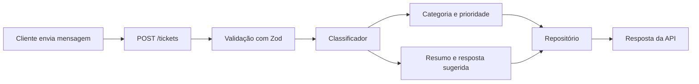

# Arquitetura

## Fluxo principal

## Camadas

### Domain

Define os tipos e as entidades centrais do projeto.

### Schemas

Valida os dados recebidos pela API.

### Services

Concentra as regras de classificação e priorização.

### Repositories

Abstrai o armazenamento. O MVP utiliza memória, permitindo substituir a
implementação por SQLite ou PostgreSQL sem alterar as rotas.

### Routes

Expõe as funcionalidades por meio de endpoints HTTP.
